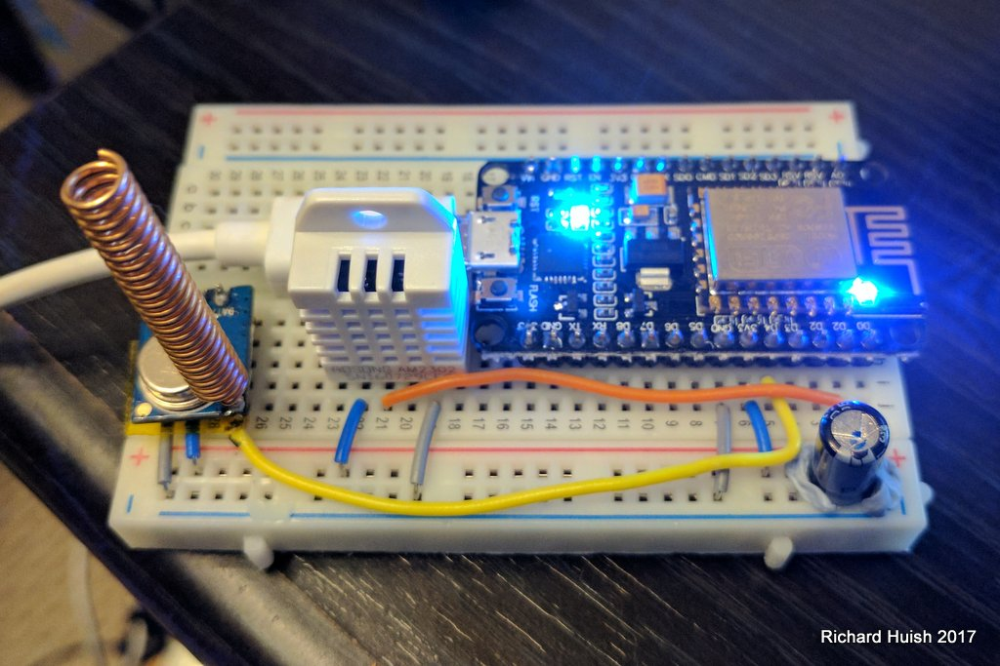

# Lighting-Controller-Gatway

433Mhz transmitter MQTT gateway running on ESP (ESP8266 NodeMCU) - Arduino platformIO IDE

## Matching Home Assistant Home Automation Hub Configuration

https://github.com/Genestealer/Home-Assistant-Configuration

## Info

  ESP8266 433Mhz Controller Gateway (Formally Lighting Controller)
  
  Richard Huish 2016-2017
  
  ESP8266 based with local home-assistant.io GUI, 433Mhz transmitter for lighting control and DHT22 temperature-humidity sensor.
  
  Temperature and humidity sent as JSON via MQTT
    
  ----------
  
Key Libraries:
  
  ESP8266WiFi.h     // ESP8266 core for Arduino https://github.com/esp8266/Arduino
  
  PubSubClient.h     // Arduino Client for MQTT https://github.com/knolleary/pubsubclient
  
  RCSwitch.h        // RF control lib, https://github.com/sui77/rc-switch
  
  DHT.h          // DHT Sensor lib, https://github.com/adafruit/DHT-sensor-library
  
  Adafruit_Sensor.h // Have to add for the DHT to work https://github.com/adafruit/Adafruit_Sensor
  
  private.h        // Passwords etc not for github
  
  ESP8266mDNS.h     // Needed for Over-the-Air ESP8266 programming https://github.com/esp8266/Arduino
  
  WiFiUdp.h        // Needed for Over-the-Air ESP8266 programming https://github.com/esp8266/Arduino
  
  ArduinoOTA.h      // Needed for Over-the-Air ESP8266 programming https://github.com/esp8266/Arduino
  
  ArduinoJson.h    // For sending MQTT JSON messages https://bblanchon.github.io/ArduinoJson/
  
  
  ----------
  
  GUI: Locally hosted home assistant https://home-assistant.io
  
  MQTT: Locally hosted broker https://mosquitto.org/
  
  Over the Air Updates (OTA)
  ----------
  
  The circuit:
  
    NodeMCU Amica (ESP8266)
  
  Inputs:
  
    DHT22 temperature-humidity sensor - GPIO pin 5 (NodeMCU Pin D1)
    
  Outputs:
  
    433Mhz Transmitter - GPIO pin 2 (NODEMCU Pin D4)
    
    LED_NODEMCU - pin 16 (NodeMCU Pin D0)
    
    LED_ESP - GPIO pin 2 (NodeMCU Pin D4) (Shared with 433Mhz TX)
    
----------    
  Notes:
  
  NodeMCU LED lights to show MQTT conenction.
  
  ESP LED lights to show WIFI conenction.
  
----------  
  Edits made to the PlatformIO Project Configuration File:
  
      platform = espressif8266_stage 
      
  https://github.com/esp8266/Arduino/issues/2833 as the standard has an outdated Arduino Core for the ESP8266, ref http://docs.platformio.org/en/latest/platforms/espressif8266.html#over-the-air-ota-update
  
    build_flags = -DMQTT_MAX_PACKET_SIZE=512
    
  Overide max JSON size, untill libary is updated to inclde this option https://github.com/knolleary/pubsubclient/issues/110#issuecomment-174953049    
  

